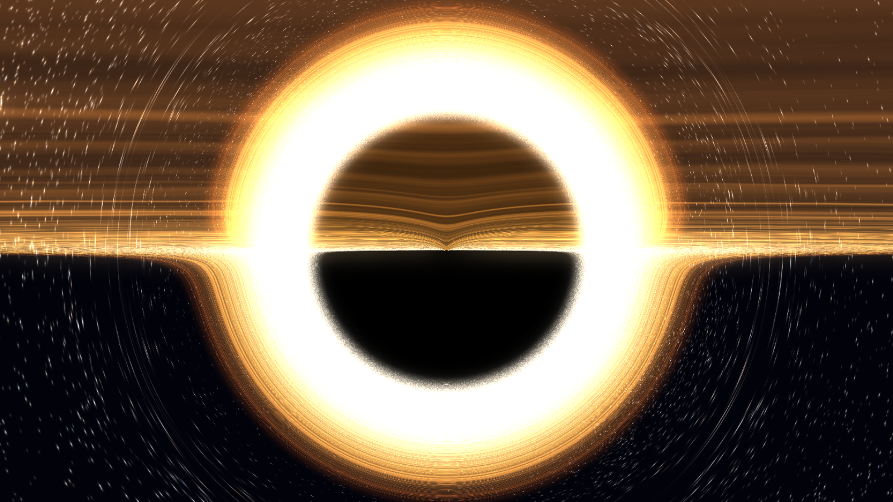

# The Black Hole

An energy-efficient 3D screensaver that simulates a black hole. The camera
warps in beside one, holds still while the universe bends around it, and warps
away to another. The Einstein ring, the photon sphere, the accretion disk's far
side arcing over the top of the shadow and the secondary images just outside it
are not painted on: they come from tracing a light ray through curved spacetime
for every pixel.



The 3D engine comes from [The Black Wall](https://github.com/ErickDoppler/Screensaver-TheBlackWall).

Status: **Windows: in development, runs well.** **Linux (XScreenSaver): the
code and scripts are written, but not yet tested on Linux.**

## Run it

### Windows

Everything is portable and open source. Nothing is installed system-wide
except the screensaver itself, no administrator rights are needed, and Visual
Studio is not needed.

1. **Get the build tools.** Downloads GCC ([w64devkit](https://github.com/skeeto/w64devkit)),
   CMake, Ninja and the SDL3 source into `C:\workenv`, checking every archive
   against a pinned SHA-256. Run it once; running it again only verifies what
   is already there.

   ```bat
   1-download-tools-windows.cmd
   ```

   To put the tools somewhere else, pass the folder
   (`1-download-tools-windows.cmd D:\tools`) and set `BH_WORKENV` to it before
   step 2.

2. **Build and install.** Compiles `build\win-mingw\TheBlackHole.scr`, a
   single static executable with no runtime dependencies, checks it with
   Microsoft Defender, copies it to `%LOCALAPPDATA%\TheBlackHole` and makes
   it the active screensaver for the current user. The first build takes a
   couple of minutes, because SDL3 is compiled from source.

   ```bat
   2-build-and-install-windows.cmd
   ```

Then open **Settings > Personalization > Lock screen > Screen saver** (or run
`control desk.cpl,,@screensaver`) to set the wait time; **Settings...** there
opens the screensaver's own options.

To look at it before installing, build with
`2-build-and-install-windows.cmd noinstall` and run
`build\win-mingw\TheBlackHole.scr /w` for a window or `/s` for fullscreen.
`Esc` always exits.

### Linux

The screensaver runs inside [XScreenSaver](https://www.jwz.org/xscreensaver/),
which works on any X11 desktop (Xfce, MATE, Cinnamon, LXQt, i3 and others).
Debian/Ubuntu, Fedora, Arch and openSUSE are supported by the scripts.

> **Not yet tested on Linux.** The code and scripts are written and
> syntax-checked, but have not yet been compiled or run on a Linux machine.
> Please report anything that fails.

1. **Get the build tools.** Installs the compiler, CMake, Ninja, the X11,
   OpenGL and Wayland headers SDL3 needs, and XScreenSaver through your
   package manager (it asks for `sudo`). Then downloads the pinned SDL3
   source into `~/workenv`, checked against its SHA-256. If your
   distribution's CMake is older than 3.25, or Ninja is missing, the official
   release binaries go into the same folder.

   ```sh
   ./1-download-tools-linux.sh
   ```

   Options: `--no-packages` (you install the packages yourself),
   `--no-xscreensaver`, `--force`, or a different target folder as the first
   argument (then set `BH_WORKENV` to it for step 2).

2. **Build and install.** Compiles `build/linux/theblackhole`, installs it
   into XScreenSaver's program folder (`/usr/libexec/xscreensaver`, or
   `/usr/lib/xscreensaver` on Arch) along with its settings page, and adds
   it to your `~/.xscreensaver` list (a backup is kept next to it).

   ```sh
   ./2-build-and-install-linux.sh
   ```

   If `~/.xscreensaver` does not exist yet, open `xscreensaver-settings` once
   and close it, then run the script again.

Then open `xscreensaver-settings` and pick **The Black Hole**. Its settings
page has the same options as the Windows dialog.

If the scripts are not executable after unpacking, run them with `bash`
(`bash 1-download-tools-linux.sh`) or `chmod +x *.sh` first.

To look at it before installing, build with
`./2-build-and-install-linux.sh --no-install` and run
`build/linux/theblackhole --window`.

**GNOME and KDE Plasma** have their own screen lockers, which cannot run
third-party screensavers. The screensaver still runs in a window there. To
use it as a screensaver, disable the desktop's own blanking and start
`xscreensaver --no-splash` at login (X11 sessions only).

## Uninstall

Windows. Add `-Purge` to also remove the saved settings in
`HKCU\Software\TheBlackHole`:

```powershell
powershell -ExecutionPolicy Bypass -File tools\install-windows.ps1 -Uninstall
```

Linux. Settings in `~/.config/theblackhole` are kept:

```sh
./2-build-and-install-linux.sh --uninstall
```

## Build options

The numbered scripts above are all you need for a normal build. This section
covers anything other than a plain Release build.

**Windows:** `2-build-and-install-windows.cmd` accepts, in any order:

| Argument    | Effect                                                      |
|-------------|-------------------------------------------------------------|
| `debug`     | symbols, no stripping, into `build\win-mingw-debug`         |
| `clean`     | delete the build folder first (full rebuild)                |
| `noinstall` | build only (`tools\build-windows.cmd` is a shortcut for it) |
| `noscan`    | skip the Defender check                                     |

By hand, with the toolchain on PATH:

```bat
call tools\env.cmd
cmake --preset win-mingw
cmake --build --preset win-mingw
powershell -ExecutionPolicy Bypass -File tools\install-windows.ps1
```

**Linux:** `2-build-and-install-linux.sh` accepts:

| Option          | Effect                                                    |
|-----------------|-----------------------------------------------------------|
| `--debug`       | symbols, into `build/linux-debug`                         |
| `--clean`       | delete the build folder first                             |
| `--no-install`  | build only                                                |
| `--system-sdl`  | link the distribution's SDL3 (3.2 or newer) instead of building it |
| `--prefix DIR`  | install under `DIR` instead of XScreenSaver's own folders; `~/.xscreensaver` then gets the full path |
| `--uninstall`   | remove the installed files and the list entry             |

By hand:

```sh
cmake --preset linux -DFETCHCONTENT_SOURCE_DIR_SDL3=$HOME/workenv/SDL3-3.4.16
cmake --build --preset linux
sudo cmake --install build/linux
```

Without `FETCHCONTENT_SOURCE_DIR_SDL3`, CMake downloads SDL3 itself during
configure, checked against the same pinned hash. The `linux-system-sdl` preset
uses an installed SDL3 instead.

## Windows Defender

A freshly compiled, unsigned `.scr` can trip Defender's machine-learning
heuristics (typically reported as `Trojan:Win32/Wacatac.*!ml`). The build
avoids what those heuristics score:

* **Keyboard access.** The screensaver's own code never polls the global
  keyboard (`GetAsyncKeyState` on a timer is what keyloggers do). The hidden
  `Ctrl+Alt+S` shortcut in the settings dialog is read from the dialog's own
  message queue.
* **No self-launching.** It never starts other programs or relaunches itself:
  the dialog's **Preview** runs in the same process.
* **Unused SDL code removed.** SDL's dynamic-API layer is compiled out and
  unused code is dropped at link time. Process spawning and URL opening are
  not in the binary, and no DLL is loaded because an environment variable
  names it. The two keyboard-related imports that remain belong to SDL's
  standard window code, which every SDL3 program carries.
* **A well-formed executable.**
  * **Hardening:** stripped, statically linked, ASLR (with a relocation
    table and high-entropy addressing) and DEP.
  * **Metadata:** a Windows 7+ subsystem version, full version information,
    and a manifest that declares `asInvoker` and the supported Windows
    versions.

The build script scans the result with Defender without quarantining it, and
prints its SHA-256. Behavioural detections on the first run are still
possible. If one happens:

1. **Report the false positive** at
   https://www.microsoft.com/wdsi/filesubmission (choose "Software developer")
   and attach `TheBlackHole.scr`. Microsoft usually clears it within a day or
   two, and the fix reaches everyone through definition updates.
2. **Keep using it meanwhile:** restore the file from **Windows Security >
   Protection history**, and add an exclusion for
   `%LOCALAPPDATA%\TheBlackHole`.
3. **Remove the problem at the root** by code-signing the `.scr` with a
   certificate from a public CA, since reputation attaches to the signer.

## How it is drawn

Two stages, and the split is the whole design:

1. **The star field** is real point sprites - 5500 of them by default, one
   `glDrawArrays` with no vertex buffers, inherited wholesale from The Black
   Wall along with its anti-moire sprite sizing. They are drawn into the six
   faces of a sky cube map. This is where *Particle size*, *Star twinkle* and
   the star colour live.
2. **The hole** is one fullscreen pass. For each pixel it integrates
   `d2u/dphi2 = -u + 3u^2` (`u = 1/r`) with velocity Verlet, in the plane that
   the camera position and the ray direction span - which in a Schwarzschild
   field is the whole three-dimensional problem. Rays that cross the horizon
   come back black; the rest are used to read the cube map along the direction
   the light *actually* came from, picking up the accretion disk wherever the
   geodesic crosses its plane. Ghost tails, blur and camera damage run after.

The **binary scenes** cannot use that shortcut: a second mass off the ray's
plane pulls the light out of it. They march in full 3D instead, summing each
hole's pull with the angular momentum about that hole.

Geometric units, `M = 1`: the horizon is at `r = 2`, the photon sphere at
`r = 3`, the shadow's edge at an impact parameter of `3*sqrt(3) = 5.196`.
Working in units of `M` is also what keeps the arithmetic in float range - a
supermassive horizon is 10^10 metres across.

Everything offscreen renders at a fraction of the window and is upscaled in the
final blit. The picture is nearly all smooth gradient, so half resolution is
almost free to look at, and it is the difference between a screensaver and a
space heater. The **Quality** setting drives integration steps, that fraction
and the cube map size together; left on *auto* it settles itself against the
frame budget on the first run and remembers where it landed.

**Camera damage** wears the picture in cycles: after the grace period, cracks
creep out from an impact and sensor pixels die one at a time, then everything
heals over the heal time, stays clean for the grace period again, and the next
round begins.

## Command line

Windows calls the screensaver with the standard switches:

| Switch      | Meaning                                              |
|-------------|------------------------------------------------------|
| `/s`        | run fullscreen across all monitors                   |
| `/p <hwnd>` | live preview inside the Windows screensaver dialog   |
| `/c`        | settings dialog (also the default with no arguments) |

XScreenSaver runs it with `-root` and passes its window in
`$XSCREENSAVER_WINDOW` (older versions: `-window-id <id>`).

Developer switches (both platforms):

| Switch                          | Meaning                                          |
|---------------------------------|--------------------------------------------------|
| `/w` or `--window 1600x900`     | run in a resizable window                        |
| `--dump out.png --frames 90`    | render 90 frames, save the last one, exit        |
| `--scene <name>`                | start on one scene (see below)                   |
| `--cover 0.8`                   | force the shadow's share of the screen height    |
| `--theta 0.12`                  | force how far out of the disk plane the camera sits |
| `--disk-outer 45`               | force the disk's outer radius, in M              |
| `--lens 60`                     | force the vertical field of view, in degrees     |
| `--trace`                       | log the camera and the clocks twice a second     |
| `--seed 1234`                   | fix the run's random seed                        |
| `--settled`                     | skip the arrival warp                            |
| `--log file.txt`                | append diagnostics to a file                     |
| `--<setting> <value>`           | override any setting, e.g. `--spin 950 --star-count 12000 --disk-color #ff8800` |

On Windows, launching a `.scr` from Explorer or `Start-Process` replaces its
arguments with `/S`. To pass developer switches, run it from `cmd`, or copy
it to a `.exe`.

Scene names: `void`, `fed`, `feeding`, `evaporating`, `stardust`,
`binary-void`, `binary-fed`, `nebula`, `core`, `aftermath`.

Setting keys (see `src/settings.h` for ranges and defaults):

* **Motion:** `side-movement`, `movement-speed`, `mouse-rotation`,
  `exit-on-mouse-move`, `mouse-sensitivity`, `click-resets-view`,
  `exit-on-any-key`, `rotate-360`, `rotate-mode` (orbit/yaw/tumble),
  `rotate-seconds`, `warp-minutes`, `fov`
* **Particles and light:** `star-count`, `particle-size`, `ghost-tail`,
  `blur`, `twinkle`, `natural-star-color`, `bloom`
* **Physics:** `spin`, `lensing`, `doppler` (interstellar/true), `redshift`,
  `higher-order`, `time-dilation`
* **Events and scenes:** `jets`, `event-merger`, `event-fallin`,
  `event-flare`, `scene-mask` (e.g. `void,fed,core`)
* **Camera damage:** `damage`, `damage-grace` (minutes clean before and
  between rounds), `damage-heal` (seconds), `damage-glass`, `damage-matrix`,
  `damage-palette` (white/green/black/custom)
* **Performance:** `quality` (0 = auto), `fps`
* **Colours:** `star-color`, `space-color`, `disk-color`, `ring-color`,
  `shadow-color`, `nebula-color`, `damage-color`

Boolean settings also take `--no-<key>`.

Settings persist in `HKCU\Software\TheBlackHole` on Windows and in
`~/.config/theblackhole/settings.conf` on Linux.

## Controls

| Key                       | Action                                  |
|---------------------------|-----------------------------------------|
| Arrows or WASD            | fly: forward, back, strafe               |
| PageUp / Space, PageDown / Z | rise, drop                            |
| Shift / Ctrl              | three times faster / a third the speed   |
| Mouse, or J/L and I/K     | look around                              |
| Enter                     | warp to another hole, at another distance |
| Home or R                 | recentre the view                        |
| Ctrl+Alt+S                | next scene (in the settings dialog: show the scene list) |
| Esc                       | exit (always)                            |

Under XScreenSaver, input belongs to XScreenSaver: any key or mouse movement
ends the screensaver as usual.

**The orbit never stops.** Looking around does not pause it and neither does
flying: the camera's path around the hole and where you happen to be pointing
are different things, and freezing the sky because a mouse got nudged makes the
whole screensaver look like it has crashed. Your aim simply eases back to
facing the hole once you stop.

**Flying is real; arriving is not.** The keys give the camera a genuine
velocity, and everything that velocity should do, it does - the near-field dust
streams past at the right rate and in the right direction, and the disk shears
under it. What it cannot do is close the distance. The hole is hundreds of
light years away; nobody crosses that by holding a key down, and swelling the
shadow to pretend otherwise would be the one dishonest thing in the picture.

## Layout

```
1-download-tools-windows.cmd   toolchain into C:\workenv (Windows)
2-build-and-install-windows.cmd build, Defender check, install (Windows)
1-download-tools-linux.sh      packages + SDL3 source into ~/workenv (Linux)
2-build-and-install-linux.sh   build, install into XScreenSaver (Linux)
src/            portable C11 core (SDL3 + OpenGL 3.3), platform_win32.c / platform_linux.c
src/shaders/    GLSL, embedded into the binary at build time
res/win32/      dialog, manifest, icon, version info
res/linux/      XScreenSaver settings page
cmake/          toolchain file + shader embedding script
tools/          env / build / install / icon helpers
docs/           design notes and screenshots
third_party/    stb_image_write.h (public domain)
```

See [docs/DESIGN.md](docs/DESIGN.md) for the full specification.

## License

MIT. Dependencies: SDL3 (zlib), stb (public domain / MIT). Build tools:
w64devkit / GCC (GPL with runtime exception), CMake (BSD), Ninja (Apache 2.0).
